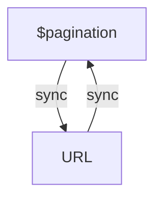
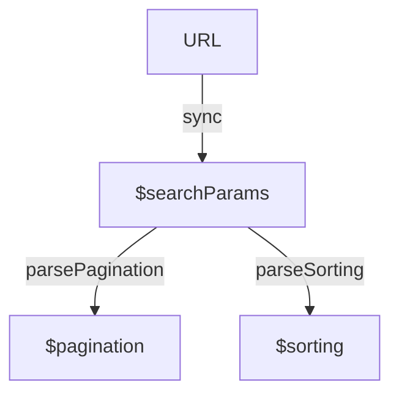

# Frontend Kungfu: URL

[Русский 🇷🇺](https://github.com/13luck/frontend-kungfu-url#frontend-kungfu-url) &nbsp;`English 🇬🇧`


I've been working as a frontend developer for already 11 years and I have observed the same problem occurring on every project.
We often encounter difficulties when trying to synchronise the application state with the browser address bar.
These difficulties arise from a lack of control over the direction of the data flow.
And sometimes we unconsciously implemet *glitch* at the core of our solutions.
Glitch in reactive systems is a temporal mismatch that can occur when a value is propagated.
In this short article I'll share my experience on how to avoid this. It will help you:

- reduce the complexity of the ui system;
- increase efficiency: the amount of code written vs the final result;
- increase reliability against failures.

Usually saving data in the address bar will help you restore states when the page reloads.
For example, you have an online shop and a user has set filters, you can display the same products and filters when user returns to the page later. This is also handy if a user wants to share a list of products with someone else.
This creates a more convenient and consistent experience for the user.

## Source of Truth

A basic tip is to use the browser URL as the main source of data for component states.
This means that any changes to the components can be tracked via the URL, e.g.: `http://site.com/list?pageIndex=1&pageSize=10`.

The syntax for the parameters can be unique to your project or you can use the native URLSearchParams.
In this case, the part after the question symbol `?` can be treated as the serialised state of the component: `{ pageIndex: 1, pageSize: 10 }`.

Here is a simple example on React using the react-router-dom library:

```tsx
import { useSearchParams } from 'react-router-dom'

function MyComponent() {
  const [searchParams, setSearchParams] = useSearchParams()
  
  React.useEffect(() => {
    // As soon as searchParams changes we immediately update external states
  }, [searchParams])

  return (
    <div>
      ...
        
      <button onClick={() => setSearchParams({ pageIndex: 2 })}>
        goto 2 page
      </button>      
    </div>
  )
}
```

This means that all component state changes should be reflected in the `searchParams` object.
The `useSearchParams` hook works similarly to React.useState, except that in this case the native URLSearchParams is used.
Synchronization with external states proceeds inside the effect, which helps keep the component clean.

## How external states should be stored?

Let's consider the task of outputting a list with asynchronous loading, pagination and sorting.
We use the effector library to describe the state, but you can choose something else, the principle remains the same.
Initially, we could intuitively describe the states of the query objects as follows:

```ts
// bad 🚳
const $pagination = createStore({ pageIndex: 1, pageSize: 10 })
const $sorting = createStore({ sortBy: 'name', direction: 'asc' })
// ...
```

Although it looks harmless at first sight, once it may require extra effort to avoid a cyclic update conflict when synchronising state with URL.



The synchronisation problem we face is that there are two parallel and interconnected data streams: one relating to changes in the address bar and the other to changes in the application state.
These two data streams should be interconnected so that when one of them changes, the other is automatically updated.
However, sometimes situations arise where one change leads to an unnecessary, redundant change to another, which can cause unpredictable behavior.
In other words, the problem with synchronisation is the need to ensure that the address and state of the application are updated in a consistent manner.
Bidirectional binding can be a poor solution.

To avoid such complications we can apply unidirectional binding and use the `$searchParams` store as a data source, instead of creating separate standalone stores:

```ts
// good ✅
const $searchParams = createStore(new URLSearchParams())
const $pagination = $searchParams.map(parsePagination)
const $sorting = $searchParams.map(parseSorting)
```

The mapping functions do two things: they set values and they define default initial values.
The data easily passes through the mappers from top to bottom from the `$searchParams` store.



External synchronisation of router `searchParams` parameters with the `$searchParams` store only occurs internally in the effect:

```ts
React.useEffect(() => {
  sync<URLSearchParams>(searchParams)
}, [searchParams])
```

## SSR

Since React.useEffect doesn't run server-side, this means that to implement server-side rendering you'll just need to add one extra connection to hydrate the state.

## User input management

In order to update internal states in response to user input, it is crucial to use the `setSearchParams` function.
Let's look at an example: a user is performing a text search, and therefore the page index needs to be reset.

Note that by using the `updateSearchParams` utility, the code has become more clear and readable, and the behaviour of the system becomes predictable (more about the utility below).
This allows us to always keep the state correct and up to date, even when the user navigates through the `back` button.
Thus, URL and state synchronisation becomes available without too much effort 🤲

## A lilbit about URLSearchParams

[URLSearchParams](https://developer.mozilla.org/ru/docs/Web/API/URLSearchParams) is an excellent native JavaScript API for serialising data into a string.
It provides convenient methods for accessing values such as `get` and `getAll`, `append` for adding, and a `delete` method for deleting values.
It is important to note that URLSearchParams always works with values of type `string | string[]`.
If a value is missing, it will be represented as `null` or an empty array `[]`.
The `setSearchParams` setter just takes exactly the URLSearchParams type, which is to our advantage.
Here are some examples for clarity, see how it resembles JSON:

```ts
JSON.parse('{"a":"1"}').a === '1' // true

new URLSearchParams('a=1').get('a') === '1' // true
new URLSearchParams('a=1').getAll('a')      // ['1']
new URLSearchParams('a=1&a=2').getAll('a')  // ['1', '2']
new URLSearchParams().get('x')              // null
new URLSearchParams().getAll('x')           // []
```

URLSearchParams provides a powerful API, but it may be necessary to create some utilities to make it easier to manipulate the object.
Let's return to the [updateSearchParams](https://github.com/13luck/frontend-kungfu-url/blob/main/src/utils/updateSearchParams.ts) utility mentioned earlier.
This utility greatly simplifies working with keys and values, allowing you to easily add, modify and delete router parameters.
See the source code in the repository for details, but the utility is very simple and has the following behaviour:

```ts
const current = new URLSearchParams('a=1&b=2')

const updated = updateSearchParams(current)({
  a: undefined, // delete key-value
  b: '', // delete key-value
  c: [''], // delete key-value
  d: 3,
  e: ['4']
})

updated.get('a') === null
updated.get('b') === null
updated.get('c') === null
updated.get('d') === '3'
updated.get('e') === '4'
```

> When creating generic solutions, it would be best if you avoid using the `get` method, as it returns `null` for missing values. Instead, it is preferable use the `getAll` method, which always returns an array of type `string[]`.

## Conclusion

This is already enough to make things much easier.
Following the suggested approaches allows you to create robust frontend applications with predictable behaviour.
It will help to split the application logic into small components with clearly defined responsibilities, which helps to improve code cleanliness and testability.

It is also important to realise that many bugs arise when we design reactive systems using proactive techniques.
This is a clash of programming styles: imperative and functional.

I created a small demo application using the Pokedex example to demonstrate how to effectively manage the state of the application and synchronise it with the address bar.
The source code can be found in this repository.
Run the app, try filtering, pagination and sorting, and see how easy it is to navigate using the `back/forward` buttons to see how everything works in detail.
