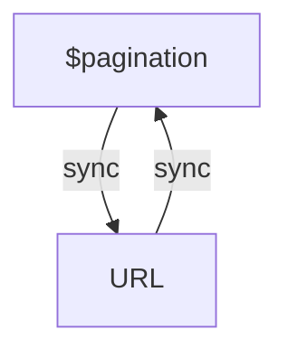
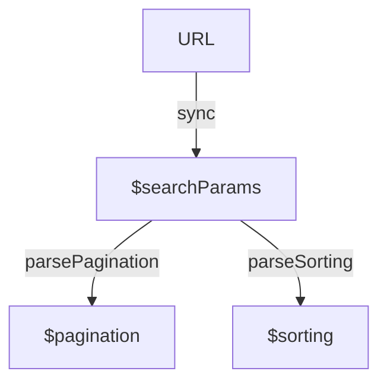

# Frontend Kungfu: URL

`Русский 🇷🇺` &nbsp;[English 🇬🇧](https://github.com/13luck/frontend-kungfu-url/blob/main/readme-en.md#frontend-kungfu-url)

В ходе многолетней работы фронтенд-разработчиком, я наблюдал, как одна и та же проблема возникает на каждом проекте.
Мы часто сталкиваемся с трудностями при попытке синхронизировать состояние приложения с адресной строкой браузера.
Эти трудности возникают из-за отсутствия контроля над направлением потока данных.
И мы, порой неосознанно, внедряем *glitch* в основу наших решений.
Глитч в реактивных системах представляет собой временное несоответствие, которое может возникнуть при распространении значения.
В этой короткой статье, я поделюсь опытом того, как этого избежать, в итоге это поможет вам:

- понизить сложность ui системы;
- повысить эффективность: кол-во написанного кода против конечного результата;
- повысить надёжность от сбоев.

Вообще сохранение данных в адресной строке поможет вам восстановливать состояния при перезагрузке страницы.
Например, у вас есть интернет-магазин, и пользователь установил фильтры, вы можете отобразить те же самые товары и фильтры, когда он вернётся на страницу позже. Также это удобно, если пользователь хочет поделиться списком товаров с кем-то ещё.
Это создаёт более удобный и последовательный опыт для пользователя.

## Source of Truth

Основным советом является использование URL браузера в качестве главного источника данных для состояния компонентов.
Это означает, что любые изменения компонентов можно отслеживать через URL, например: `http://site.com/list?pageIndex=1&pageSize=10`.

Синтаксис для параметров может быть уникальным для вашего проекта или можно использовать нативный URLSearchParams.
В этом случае часть после знака вопроса `?` может рассматриваться как сериализованное состояние компонента: `{ pageIndex: 1, pageSize: 10 }`.

Приведу простой пример на React с использванием библиотеки react-router-dom:

```tsx
import { useSearchParams } from 'react-router-dom'

function MyComponent() {
  const [searchParams, setSearchParams] = useSearchParams()
  
  React.useEffect(() => {
    // Как только происходит изменение searchParams, немедленно обновляем внешние состояния
  }, [searchParams])

  return (
    <div>
      ...
        
      <button onClick={() => setSearchParams({ pageIndex: 2 })}>
        goto 2 page
      </button>      
    </div>
  )
}
```

Это означает, что все изменения состояния компонентов должны отражаться в объекте `searchParams`.
Хук `useSearchParams` работает аналогично React.useState, за исключением того, что в данном случае используется нативный URLSearchParams.
Синхронизация с внешними состояниями происходит внутри эффекта, что позволяет сохранить чистоту компонента.

## Как следует хранить внешние состояния?

Рассмотрим задачу вывода списка с асинхронной загрузкой, пагинацией и сортировкой.
Для описания состояния мы используем библиотеку effector, но вы можете выбрать что-нибудь другое, принцип останется тот же.
Первоначально, мы могли бы интуитивно описать состояния объектов запроса следующим образом:

```ts
// плохо 🚳
const $pagination = createStore({ pageIndex: 1, pageSize: 10 })
const $sorting = createStore({ sortBy: 'name', direction: 'asc' })
// ...
```

Хотя на первый взгляд это выглядит безобидно, но однажды это может потребовать дополнительных усилий для избежания конфликта циклического обновления при синхронизации состояния с URL.



Проблема синхронизации, с которой мы сталкиваемся, заключается в том, что есть два параллельных и взаимосвязанных потока данных: один относится к изменениям в адресной строке, а другой — к изменениям в состоянии приложения.
Эти два потока данных должны быть взаимосвязаны, чтобы при изменении одного из них автоматически обновлялся другой.
Однако, иногда возникают ситуации, когда одно изменение приводит к ненужному, лишнему изменению другого, это может вызвать непредсказуемое поведение.
Иными словами, проблема синхронизации заключается в необходимости гарантировать согласованное обновление адреса и состояния приложения.
Двунаправленное связывание может стать плохим решением.

Чтобы избежать таких сложностей мы можем применить однонаправленное связывание и использовать хранилище `$searchParams` как источник данных, вместо создания отдельных самостоятельных хранилищ:

```ts
// хорошо ✅
const $searchParams = createStore(new URLSearchParams())
const $pagination = $searchParams.map(parsePagination)
const $sorting = $searchParams.map(parseSorting)
```

Функции маппинга выполняют две задачи: они устанавливают значения и определяют дефолтные начальные значения.
Данные легко проходят через мапперы сверху вниз из хранилища `$searchParams`.



Внешняя синхронизация параметров роутера `searchParams` с хранилищем `$searchParams` происходит только внутри эффекта:

```ts
React.useEffect(() => {
  sync<URLSearchParams>(searchParams)
}, [searchParams])
```

## SSR

Поскольку React.useEffect не выполняется на стороне сервера, это означает, что для реализации серверного рендеринга вам просто потребуется добавить одну дополнительную связь для гидрации состояния.

## Управление пользовательским вводом

Для обновления внутренних состояний в ответ на пользовательский ввод, крайне важно использовать функцию `setSearchParams`.
Давайте рассмотрим пример: пользователь выполняет текстовый поиск, и, следовательно, необходимо сбросить индекс страницы.

```ts
const onSearch = (text: string) => setSearchParams(
  updateSearchParams(searchParams)({
    pageIndex: undefined, // таким способом сбрасываем страницу
    text
  })
)
```

Заметьте, что с использованием утилиты `updateSearchParams`, код стал более прозрачным и читаемым, а поведение системы становится предсказуемым (подробнее про утилиту ниже).
Это позволяет нам всегда поддерживать корректное и актуальное состояние, даже при навигации пользователя через кнопку `назад`.
Таким образом, синхронизация URL и состояния становится доступной без лишних усилий 🤲

## Немного про URLSearchParams

[URLSearchParams](https://developer.mozilla.org/ru/docs/Web/API/URLSearchParams) — это отличный нативный JavaScript API для сериализации данных в строку.
Он предоставляет удобные методы доступа к значениям, такие как `get` и `getAll`, `append` для добавления, а также метод `delete` для удаления значений.
Важно отметить, что URLSearchParams всегда работает со значениями типа `string | string[]`.
Если значение отсутствует, оно будет представлено как `null` или пустой массив `[]`.
Сеттер `setSearchParams` как раз принимает именно URLSearchParams тип, что нам на руку.
Вот некоторые примеры для наглядности, посмотрите как это напоминает JSON:

```ts
JSON.parse('{"a":"1"}').a === '1' // true

new URLSearchParams('a=1').get('a') === '1' // true
new URLSearchParams('a=1').getAll('a')      // ['1']
new URLSearchParams('a=1&a=2').getAll('a')  // ['1', '2']
new URLSearchParams().get('x')              // null
new URLSearchParams().getAll('x')           // []
```

URLSearchParams предоставляет мощный API, однако для более удобной работы возможно потребуется создание некоторых утилит, чтобы упростить манипуляцию с объектом.
Вернёмся к утилите [updateSearchParams](https://github.com/13luck/frontend-kungfu-url/blob/main/src/utils/updateSearchParams.ts), о которой упоминалось чуть ранее.
Эта утилита значительно упрощает работу с ключами и значениями, позволяя легко добавлять, изменять и удалять параметры роутера.
Подробнее смотрите исходный код в репозитории, но утилита очень проста и имеет следующее поведение:

```ts
const current = new URLSearchParams('a=1&b=2')

const updated = updateSearchParams(current)({
  a: undefined, // удаляем ключ-значение
  b: '', // также удаляем ключ-значение
  c: [''], // также удаляем ключ-значение
  d: 3,
  e: ['4']
})

updated.get('a') === null
updated.get('b') === null
updated.get('c') === null
updated.get('d') === '3'
updated.get('e') === '4'
```

> При создании обобщённых generic решений будет лучше, если вы откажетесь от использования метода `get`, так как он возвращает `null` для отсутствующих значений. Вместо него предпочтительнее использовать метод `getAll`, который всегда возвращается массив типа `string[]`.

## Заключение

Этого уже достаточно, чтобы всё стало в разы проще.
Соблюдение предложенных подходов позволяет создавать надёжные фронтенд приложения с предсказуемым поведением.
Это поможет разбить логику приложения на небольшие компоненты с чётко определёнными обязанностями, что способствует повышению чистоты кода и его тестируемости.

Важно также осознавать, что многие ошибки возникают, когда мы проектируем реактивные системы с применением проактивных методов.
Это столкновение стилей программирования: императивного и функционального.

Я создал небольшое демо приложение на примере Pokedex, чтобы продемонстрировать, как эффективно управлять состоянием приложения и синхронизировать его с адресной строкой.
Исходный код можно найти в этом репозитории.
Запустите приложение, попробуйте фильтрацию, пагинацию и сортировку, и убедитесь, как легко можно навигироваться с помощью кнопок `назад/вперёд`, чтобы понять, как всё работает в деталях.
